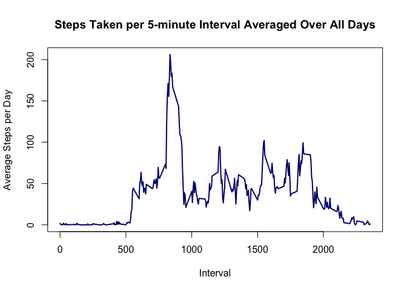

# Reproducible Research: Peer Assessment 1


## Loading and preprocessing the data


```r
# reads in the activity data
activity = read.table(unz("activity.zip", "activity.csv"), header = T, sep = ",")

# converts the date variable to type "Date"
activity = transform(activity,date = as.Date(as.character(date), "%Y-%m-%d"))

# Convert interval variable to a factor of repeating intervals
activity = transform(activity, interval = factor(interval))

# Aggregates steps by day
Grouped_steps = with(activity, aggregate(steps, list(date), sum, na.rm = T))
steps_by_day = Grouped_steps[[2]]
```

## What is mean total number of steps taken per day?

The histogram of the total number of steps per day is plotted below

```r
# Histogram of total steps taken per day
hist(steps_by_day, xlab = "Total Steps/day", col = "orange",
                    main = "Histogram of Total Steps/ day", breaks = 5)
```

<!-- -->

The mean and median of number of steps taken each day are computed and stored in MeanSteps and MedianSteps respectively in the following code chunk


```r
MeanSteps = round(mean(steps_by_day, na.rm = T),0)
MedianSteps = median(steps_by_day, na.rm = T)

print(paste("Mean steps per day: ", MeanSteps))
```

```
## [1] "Mean steps per day:  9354"
```

```r
print(paste("Median steps per day: ", MedianSteps))
```

```
## [1] "Median steps per day:  10395"
```


## What is the average daily activity pattern?
The Time series plot of the average number of steps taken per day is plotted below

```r
# Aggregates the steps by mean over the 5 minute intervals
AvgStepsDF = with(activity, aggregate(steps, list(interval), mean, na.rm = T))
names(AvgStepsDF) = c("Interval", "AverageSteps")
AvgStepsDF = transform(AvgStepsDF, Interval = as.numeric(as.character(Interval)))

# Time series plot of steps taken per day
plot(AvgStepsDF, ylab = "Average Steps per Day", xlab = "Interval",
     type = "l", lwd = 2, col = "navy", main = "Steps Taken per 5-minute Interval Averaged Over All Days")
```

<!-- -->

The 5-minute interval that on average contains the maximum number of steps is given computed by the code chunk below


```r
IntervalAvg =  with(activity, aggregate(steps, list(interval), mean, na.rm = T))

MaxIntAvg = IntervalAvg[which.max(IntervalAvg[[2]]),1]
MaxIntAvg = as.character(MaxIntAvg)

print(paste("5 minute interval with highest number of steps on average: Interval", MaxIntAvg))
```

```
## [1] "5 minute interval with highest number of steps on average: Interval 835"
```

## Imputing missing values
Missing data is imputed below

```r
# loads the mice library which carries out mulitple imputation 
# by comparing trends in other variable; in this case, the interval variable
library(mice)
```

```
## Loading required package: Rcpp
```

```
## Warning: package 'Rcpp' was built under R version 3.2.5
```

```
## mice 2.25 2015-11-09
```

```r
#sets seed value for reproducability
set.seed(1)

# Impute steps variable using the interval variable and stores dataframe in temp
temp = complete(mice(activity[,c(1,3)]))
activity2 = activity
activity2$steps = temp$steps
```

The histogram of the total number of steps per day is plotted below

```r
# Histogram of total steps taken per day after imputation

# Aggregates steps by day
steps_by_day2= with(activity2, aggregate(steps, list(date), sum))[[2]]
par(mfrow = c(1,2))

hist(steps_by_day, xlab = "Total Steps/day", col = "orange",
                    main = "(Pre-Imputation)", breaks = 5)

hist(steps_by_day2, xlab = "Total Steps/day", col = "red",
                    main = "(Post-Imputation)", breaks = 5)
```

<!-- -->


## Are there differences in activity patterns between weekdays and weekends?
A panel plot comparing the average number of steps taken per 5-minute interval across weekdays and weekends is generated by the following code chunk

```r
# Creating a factor variable denoting wether the data in question is a Weekday or Weekend
activity$Weekday = weekdays(activity$date)
activity$Weekday = ifelse(activity$Weekday %in% c("Saturday","Sunday"),0,1)
activity = transform(activity, Weekday = factor(Weekday, labels = c("Weekend","Weekday")))


# aggregating steps by mean over 5 minute interval and Weekend/Weekday criterion
AveStep5 = with(activity, aggregate(steps, list(interval, Weekday), mean, na.rm = T))
names(AveStep5) = c("interval","weekday", "steps")
AveStep5 = transform(AveStep5, interval = as.numeric(as.character(interval)))

# setting the limits on the x axis to make the plots easily comparable
ylim = c(min(AveStep5[[3]]),max(AveStep5[[3]]))


par(mfrow = c(2,1), mar = c(4,4,2,2))

with(subset(AveStep5, weekday == "Weekday"),
     plot(interval, steps,xlab = "Intervals", ylab = "Steps", main = "Weekdays",
          pch = 20, col = "red", type = "l", lwd = 2, ylim = ylim))


with(subset(AveStep5, weekday == "Weekend"),
     plot( interval, steps, xlab = "Intervals", ylab = "Steps", main = "Weekends",
           pch = 20, col = "navy", type = "l", lwd = 2, ylim = ylim))
```

<!-- -->
